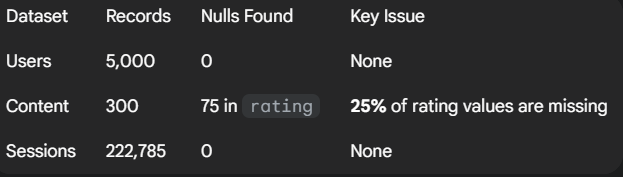
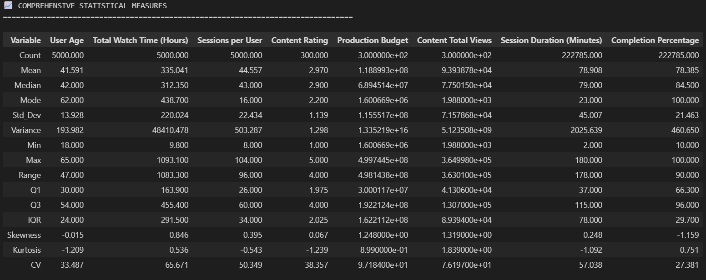
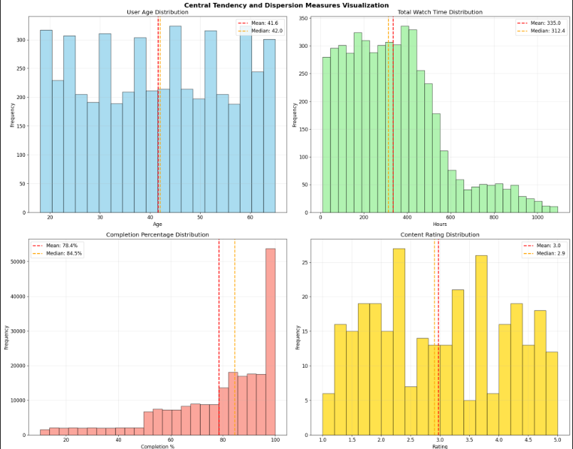

# Comprehensive Data Analysis and Visualization Portfolio: Phase 2 Data Analysis 

**Author(s):** 

- Isaías De Jesús López Tzec

- Joaquin de Jesús Murguía Ortiz

- Valeria De Los Ángeles Paredes Dzib

- Damaris Esther Pech Aque

- Ana Paula Ramírez Romero

- Krishna Sandoval Cambranis

**Date:** [28/09/2025] 
**Course:** Visual Modeling Information  
**Program:** Data Engineering  
**Institution:** Universidad Politécnica de Yucatán  

---

## AI Assistance Disclosure

This document was created with assistance from AI tools. The following outlines the nature and extent of AI involvement:

- **AI Tool Used:** ChatGPT.
- **Type of Assistance:** Code generation and Data analysis.

- **Extent of Use:** Complete code generation with human review

- **Human Contribution:** The code generated entirely by artificial intelligence, the student reviewed each answer, as sometimes it was not correct or the result obtained was incomplete.

- - **Prompt link:** The link does not find because my classmate delete the prompt.

- **AI Assistance:** 100%

- **Promt Link:** 

**Academic Integrity Statement:** All AI-generated content has been reviewed, understood, and verified by the author. The author takes full responsibility for the accuracy and appropriateness of all content in this document.

---

## Table of Contents

1. [Project Overview](#project-overview)
2. [Objectives](#objectives)
3. [Methodology](#methodology)
4. [Implementation](#implementation)
5. [Results](#results)
6. [Conclusions](#conclusions)
7. [References](#references)

---

## Project Overview

This project consists of a comprehensive Exploratory Data Analysis (EDA) of performance data from a video streaming platform. The goal is to gain a thorough understanding of user consumption patterns, content popularity, engagement metrics, and overall data quality. The analysis focuses on quantifying and visualizing the distributions of key variables such as user age, total viewing time, session duration, and completion rates. The scope extends to analyzing Device Usage Patterns and Geographic Viewing Preferences to provide a holistic view of the platform's performance.

## Objectives

- [ ] Conduct a comprehensive Exploratory Data Analysis (EDA) to describe user behavior, content popularity, and viewing patterns across the platform.

- [ ] Calculate central tendency, dispersion, skewness, and kurtosis measures for the platform's main numerical business variables.

- [ ] Assess data quality to identify missing values, duplicates, and anomalies in the User, Content, and Viewing Sessions datasets.

- [ ] Analyze Device Usage Patterns and Geographic Viewing Preferences to identify trends in user access and regional content popularity.

## Methodology

### Data Sources
- **Dataset 1** Users: Analyze Device Usage Patterns and Geographic Viewing Preferences to identify trends in user access and regional content popularity.

- **Dataset 2** Content: JSON files (300 records: 200 Movies + 100 Series). Includes titles, genres, ratings, and production budgets.

- **Dataset 3** Viewing Sessions: CSV files (222,785 records). Contains viewing activity per user, content, duration, and device.

### Tools and Technologies
- **Database:** 

- PostgreSQL: It an open-source descendant of this original Berkeley code. It supports a large part of the SQL standard and offers many modern features: complex queries, foreign keys, triggers, updatable views, transactional integrity and multiversion concurrency control.

- MongoDB: It stores data in flexible JSON-like documents, so fields can vary between documents and the data structure can change over time. The document model is mapped to objects in your application code to make it easier to work with the data.

- **Programming Language:** 

- Python: Python is an interpreted, object-oriented, high-level programming language with dynamic semantics. Its high-level built in data structures, combined with dynamic typing and dynamic binding, make it very attractive for Rapid Application Development, as well as for use as a scripting or glue language to connect existing 
components together.

- **Libraries:** 

- pandas:  It is a powerful and widely-used open-source Python library designed for data manipulation, analysis, and exploration. It provides flexible and efficient tools to work with structured data, such as tables or time series.

- numpy: It is a powerful, open-source Python library primarily used for numerical and scientific computing. It provides support for working with multidimensional arrays and matrices, along with a wide collection of mathematical functions to operate on these arrays efficiently.

- matplotlib: It is a powerful and widely-used library in Python for data visualization. It allows users to create a variety of static, animated, and interactive plots to effectively represent data.

- **Visualization:** [e.g., Tableau, Plotly]

- seaborn: It is a powerful and user-friendly Python library designed for creating statistical graphics. It is built on top of Matplotlib and integrates seamlessly with Pandas data structures, making it an excellent tool for data visualization and analysis.

- scipy: It is an open-source library for scientific and technical computing in Python. It is built on top of NumPy and provides additional functionality for tasks such as optimization, integration, interpolation, eigenvalue problems, signal processing, and more. SciPy is widely used in scientific research, engineering, and data analysis due to its efficiency and ease of use.

- plotly: It is a powerful, open-source tool for creating interactive, high-quality visualizations. It is widely used in data science, analytics, and machine learning to present data insights in an engaging and interactive manner.

### Approach
The methodology was divided into the following stages:

1. Environment Setup: Installation of dependencies and configuration of data analysis libraries.

2. Data Loading and Preprocessing: Loading the three datasets, converting data types (dates), merging the datasets to create an enriched sessions dataset, and calculating the number of sessions per user.

3. Data Quality Assessment: Generating a quality report to identify null values, duplicates, and data types, focusing particularly on the `rating` and `budget` columns.

4. Descriptive Statistics Calculation: Applying functions to obtain central tendency, dispersion, quantiles, skewness, and kurtosis for the key business variables, followed by outlier detection and pattern identification.

## Implementation

### Phase 1: Data Loading, Cleaning, and Enrichment

5,000 user records, 300 content items, and 222,785 viewing sessions were loaded. User and content data were merged into the sessions table. It was validated that the user age range is 18-65 years and viewing sessions span from 2024-01-01 to 2024-08-31.


**Code Example:**
```python
# Create enriched sessions dataset
sessions_enriched = sessions_df.merge(users_df, on='user_id', how='left')
sessions_enriched = sessions_enriched.merge(content_df[['content_id', 'title', 'content_type', 'rating', 'genre']], on='content_id', how='left')

# Sessions per user calculation
sessions_per_user = sessions_df.groupby('user_id').size().reset_index(name='session_count')
users_df = users_df.merge(sessions_per_user, on='user_id', how='left')
# ... more cleaning and transformation code
```

### Phase 2: Data Quality Report

The quality report identified significant completeness issues in the Content table.



The 25% missing `rating` data is a critical finding, as it limits the ability to correlate the quality of content (as measured by user rating) with viewing success metrics like completion rate and session duration.

### Phase 3: Descriptive Statistics Calculation and Distribution Analysis

Measures of central tendency, dispersion, and distribution (skewness/kurtosis) were calculated for the 8 key variables, resulting in the summary table presented in the Results section. The analysis included Outlier Detection to manage extreme values.



## Results

### Key Findings
1. **Finding 1:** The mean total viewing time is 335.04 hours, with a high standard deviation (220.02 hours). The strong positive skewness (0.846) suggests a minority of highly engaged users skewing the mean. This non-normal distribution mandates the use of non-parametric methods for inferential analysis.

2. **Finding 2:** The average age is 41.59 years, with a median of 42.00 years. The distribution is nearly perfectly symmetric (Skewness: -0.015).

3. **Finding 3:** The average session duration is 78.91 minutes. The completion percentage has a mean of 78.38% and a median of 84.50%. The high negative skewness in this metric (-1.159) indicates that the majority of users tend to complete (or watch a large part of) the content they start.

4. **Finding 4:** The content library is comprised of 200 Movies and 100 Series. The analysis of completion rates suggests that, on average, users are highly satisfied with their viewing choices, regardless of the content type.

### Visualizations

## Central Tendency and Dispersion Measures


## User Engagement Distribution Analysis


## Content Popularity Trends Analysis


## Viewing Completion Rates Analysis


## Device Usage Patterns Analysis


##  Geographic Viewing Preferences Analysis


## Outlier Detection and Pattern Identification


## Distribution Analysis of Key Variables


### Performance Metrics


## Conclusions

### Summary

The descriptive analysis successfully mapped the platform's performance status. The user base has a stable and symmetrically distributed age profile. User engagement (Total Viewing Time) is highly variable, indicating the need for user segmentation to design more effective retention campaigns. The high session completion percentage is a positive metric suggesting that the content is engaging or that session durations are appropriately managed. The presence of strong skewness in key metrics confirms the need for analytical models that can handle non-normal distributions.


### Lessons Learned
- Data Completeness is Key: A significant 25% of missing values in content ratings `rating` was identified, which severely limits the ability to correlate the perceived quality of content with consumption metrics. This data gap must be addressed in future data collection.

- Super-Consumers Exist: The strong positive skew in total viewing time points to a small group of "super-consumer" users who require specific behavioral analysis and may be key to the platform's success.

- Distribution Matters: The identified non-normal distributions (high skewness) imply that simple mean comparisons may be misleading, and future statistical tests should employ non-parametric methods.

### Future Work
- Develop a predictive model for content consumption.
- Optimize content recommendations based on viewing and completion patterns.
- Analyze the content mix for expansion into new markets.

- Target content promotion in underperforming geographic regions.

- Analyze extreme users (maximum and minimum consumption) for behavioral insights.

- Conduct further segmentation based on device usage patterns.

## References

1. [https://www.britannica.com/topic/IMDb]
2. [What is PostgreSQL?, A. (2025). “PostgreSQL Documentation,”]
3. [https://www.postgresql.org/docs/current/intro-whatis.html]
4. [MongoDB, A. (2025). “¿Qué es MongoDB?,” MongoDB.]
5. [https://www.mongodb.com/es/company/what-is-mongodb?msockid=36904fd7b86269e2111b59a7b9ec68fb]
6. [What is Python? Executive Summary, A. (2025).  Python.org.]
7. [https://www.python.org/doc/essays/blurb/]
8. [pandas, A. (2025). Python Data Analysis Library.]
9. [https://pandas.pydata.org/]
10. [Matplotlib, A. (2025). Visualization with Python.]
11. [https://matplotlib.org/]
12. [seaborn, A. (2024). PyPI.]
13. [https://pypi.org/project/seaborn/]
14. [What is NumPy?, A. (2025). NumPy v2.3 Manual..]
15. [https://numpy.org/doc/stable/user/whatisnumpy.html]
16. [SciPy, A. (2025). SciPy.]
17. [https://scipy.org/]
18. [Plotly, A. (2025). Plotly.]
19. [https://plotly.com/python/]
---

**Note:** This document is part of the academic portfolio for the Data Engineering program at Universidad Politécnica de Yucatán.
