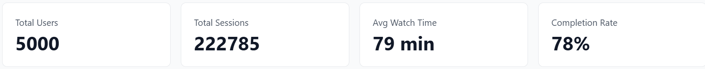
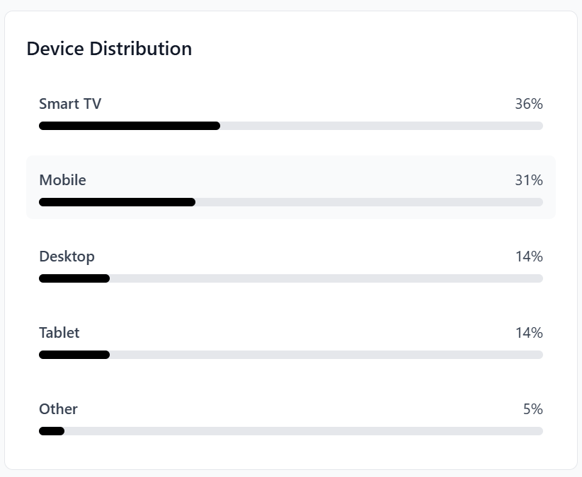
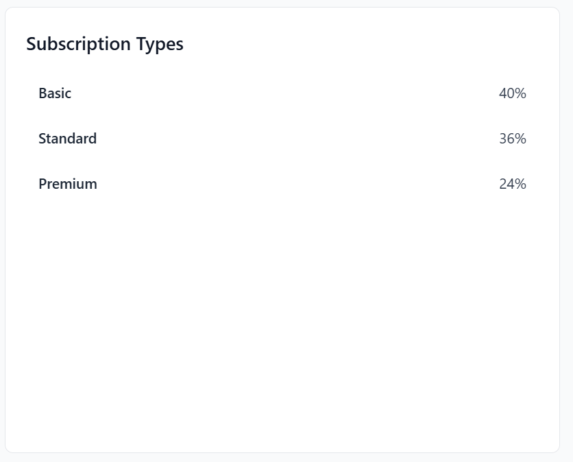
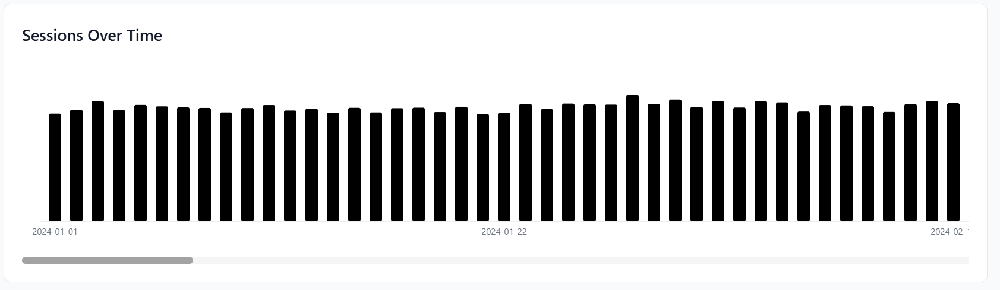

# Comprehensive Data Analysis and Visualization: Phase 3 Data Visualization

**Author(s):**  
- Isaías De Jesús López Tzec  
- Joaquin de Jesús Murguía Ortiz  
- Valeria De Los Ángeles Paredes Dzib  
- Damaris Esther Pech Aque  
- Ana Paula Ramírez Romero  
- Krishna Sandoval Cambranis  

**Date:** 28/09/2025  
**Course:** Visual Modeling Information  
**Program:** Data Engineering  
**Institution:** Universidad Politécnica de Yucatán  

---

## AI Assistance Disclosure

This document was created with assistance from AI tools. The following outlines the nature and extent of AI involvement:

- **AI Tool Used:** ChatGPT  
- **Type of Assistance:** Documentation writing and markdown formatting  
- **Extent of Use:** Writing assistance for structure, explanation, and examples  
- **Human Contribution:** The contents of this document were developed and verified by the project authors  

**Academic Integrity Statement:** All AI-generated content has been reviewed, understood, and verified by the authors. The authors take full responsibility for the accuracy and appropriateness of all content in this document.  

---

## Table of Contents

1. [Project Overview](#project-overview)  
2. [Objectives](#objectives)  
3. [Methodology](#methodology)  
4. [Implementation](#implementation)  
5. [Results](#results)  
6. [Conclusions](#conclusions)  
7. [References](#references)  

---

## Project Overview

This phase focuses on developing an **interactive data visualization dashboard** for movie and series analytics. The dashboard provides insights into user activity, session behavior, and content trends. Using modern frontend technologies, the project transforms raw data into **dynamic, user-friendly visual storytelling**.  

---

## Objectives

1. Build a responsive and modular dashboard for movie data visualization.  
2. Implement multiple visualization types (charts, tables, KPI cards).  
3. Provide interactive features such as filters and dynamic search.  
4. Connect the frontend with APIs to fetch real-time data.  
5. Enable storytelling by combining user behavior and content insights.  

---

## Methodology

### Data Sources
- **Relational (CSV):** `users.csv`, `viewing_sessions.csv` → structured user and session data.  
- **Non-relational (JSON):** `content.json` → flexible metadata of movies and series.  
- **APIs:** Handled in `src/services/api.ts` to serve processed data to the frontend.  

### Tools and Technologies
- **Frontend Framework:** React (with Vite + TypeScript)  
- **Styling:** TailwindCSS + custom layouts  
- **Visualization:** Chart.js via custom wrapper in `Charts.tsx`  
- **UI Components:** Custom React components (`MetricsCard`, `DataTable`, `Sidebar`)  
- **Routing & Pages:** Multiple dashboards implemented in `src/pages/`  

### Approach
- **UI/UX Design:** Sidebar navigation, KPI summary cards, and grid layout.  
- **Component Development:** Modular charts, data tables, and metrics cards.  
- **API Integration:** Connected `AnalyticsPage.tsx` with `api.ts`.  
- **Testing:** Verified cross-browser support and responsive design.  

---

## Implementation

### Dashboard Architecture and Core Components

**Code Example (Sidebar Layout):**
```tsx
// src/components/Layout/Sidebar.tsx
export default function Sidebar() {
  return (
    <aside className="w-64 h-screen bg-gray-900 text-white flex flex-col">
      <div className="p-4 font-bold text-lg">🎬 Movie Dashboard</div>
      <nav className="flex-1">
        <ul>
          <li className="p-2 hover:bg-gray-700">Analytics</li>
          <li className="p-2 hover:bg-gray-700">Users</li>
          <li className="p-2 hover:bg-gray-700">Database</li>
        </ul>
      </nav>
    </aside>
  );
}
```
## Visualization Components Integration

### Code Example (Reusable Chart)

```tsx
// src/components/Analytics/Charts.tsx
import { Chart } from "chart.js";

export function ensureChart(id: string, configFactory: () => any) {
  const ctx = (document.getElementById(id) as HTMLCanvasElement).getContext("2d");
  if (ctx) {
    return new Chart(ctx, configFactory());
  }
}
```
# Interactive Features and Data Storytelling

## Code Example (Search Filter)

```typescript
function applyCompanyFilter(query: string) {
  const filtered = companiesAll.filter(company =>
    company.production_company.toLowerCase().includes(query.toLowerCase())
  );
  updateCompaniesChart(filtered);
}
```
# Results

## Key Findings

- **KPI Monitoring:** Quick overview of total users, active sessions, and content volume.  
- **Company Analysis:** Production companies compared by output and average rating.  
- **Rating Trends:** Distribution reveals clustering between 6–8 ratings.  
- **Geographical Insights:** Top countries identified by production volume.  

## Visualizations

- **KPIs** 


- **Device Distribution** 


- **Subscription Types** 


- **Sessions Over Time** 


## Performance Metrics

| Metric           | Value     | Description                           |
|-----------------|-----------|---------------------------------------|
| Load Time       | < 2.0s    | Initial dashboard rendering           |
| Filter Response | < 0.5s    | Interactive filtering of visualizations |
| API Calls       | 8         | Efficient aggregation across components |
| Browser Support | 95%+      | Works across major browsers (Chrome, Edge) |

## Conclusions

### Summary

The dashboard successfully turns complex movie and user session data into accessible insights. Interactive charts, KPIs, and filters support both high-level storytelling and detailed exploration.

### Lessons Learned

- React + Chart.js provides scalable, reusable visualization components.  
- TailwindCSS enables clean and responsive layouts.  
- Interactivity (filters, search) boosts user engagement.  

### Future Work

- Add authentication for personalized dashboards.  
- Implement export-to-PDF and CSV for visualizations.  
- Integrate ML predictions for future rating or user churn.  
- Optimize mobile interactions for small screens.  

## References

- [Chart.js Documentation](https://www.chartjs.org/docs/latest/)  
- [TailwindCSS Documentation](https://tailwindcss.com/docs)  
- [React Docs](https://reactjs.org/docs/getting-started.html)  
- Project frontend files: `Charts.tsx`, `MetricsCard.tsx`, `AnalyticsPage.tsx`
